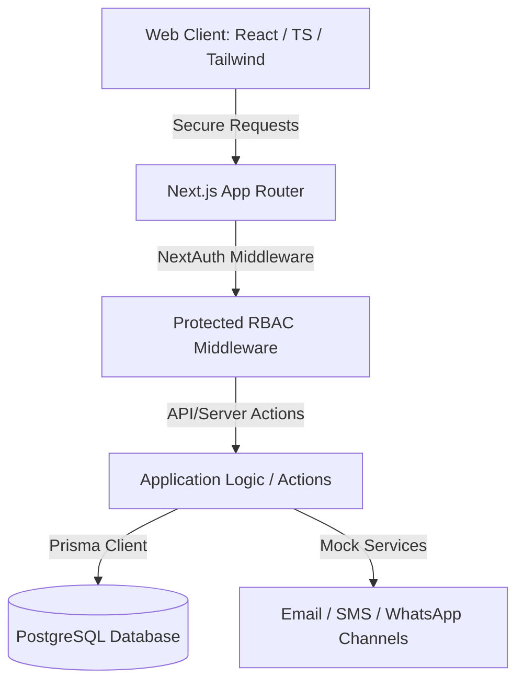

# Cosmediq Architecture Design

This document details the software architecture, design principles, role-based access control (RBAC), and deployment patterns for Cosmediq.

---

## 🏛️ Architectural Overview

Cosmediq is engineered as a modern, full-stack Monolithic Web Application using Next.js (latest App Router with React 19 and Server Actions). This ensures immediate server-side rendering for public marketing pages, secure server-action-driven dashboards, high performance, and rapid deployment.



---

## 🔒 Security & Role-Based Access Control (RBAC)

Cosmediq strictly enforces dynamic role-based access control. There are four distinct user roles, each with strict system permissions.

### 👤 User Roles and Capabilities

| Role | Access Scope | Allowed Operations |
|---|---|---|
| **Admin** | Global system parameters, clinics | Manage users, view all audits, global reports, configure system. |
| **Staff** | Branch operations & queue | Register patients, book/modify/reschedule appointments, manage tokens, track treatment billing. |
| **Doctor** | Consultation & clinical logs | View patient records, add consult notes, write prescriptions, manage personal leave. |
| **Patient** | Personal portal | View personal history, view prescriptions/reports, request appointments, view invoices. |

### 🛠️ RBAC Implementation Detail
- **Authentication Engine:** Auth.js (NextAuth.js v5) with JWT strategy and credentials provider.
- **Middleware Guard (`src/middleware.ts`):** Validates cookies at the edge, checks the parsed user role claim, and intercepts cross-role navigation attempts:
  - Route `/admin/*` matches only `ADMIN`
  - Route `/staff/*` matches `STAFF` or `ADMIN`
  - Route `/doctor/*` matches `DOCTOR` or `ADMIN`
  - Route `/patient/*` matches `PATIENT`

---

## 🚀 Scalability Design for Multi-Branch Clinics

Cosmediq scales natively through a structured branch containment model:
1. Every operations model (User, Appointment, MedicalRecord) is mapped directly or indirectly to a `branchId` referencing the `Branch` model.
2. In Phase 1, the system seeds one default active Branch, hiding branch selectors from the UI to avoid unnecessary cognitive load.
3. Adding branches in later phases requires only updating the user schema to present a dropdown or setting active branches inside the user session. All queries will automatically filter by the session-defined `branchId`.

---

## 📁 File Scaffolding Plan (Phase 1)

```
c:/Users/KARTHIK V/OneDrive/Desktop/Cosmediq/
├── docs/                      # Technical specification documents
├── public/                    # Static image/logo assets
├── src/
│   ├── app/                   # Next.js App Router
│   │   ├── (auth)/            # Auth routes (login, register)
│   │   ├── (dashboard)/       # Panel layouts for each role
│   │   │   ├── admin/
│   │   │   ├── doctor/
│   │   │   ├── patient/
│   │   │   └── staff/
│   │   ├── (public)/          # Public static website routes
│   │   ├── api/               # API endpoints
│   │   ├── layout.tsx         # Main global layouts
│   │   └── page.tsx           # Home entry page
│   ├── components/            # Reusable components
│   │   ├──ui/                 # Radix / shadcn/ui custom primitives
│   │   └──shared/             # Quotes, theme, nav, auth components
│   ├── lib/                   # Utilities, prisma clients, next-auth
│   └── hooks/                 # Custom react hooks
├── prisma/
│   ├── schema.prisma          # PostgreSQL DB models
│   └── seed.ts                # PostgreSQL seed configurations
├── package.json
└── tailwind.config.ts
```
