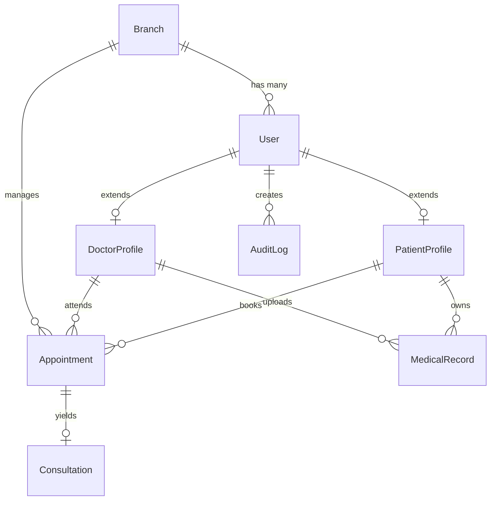

# Cosmediq Database Schema Design

This document covers the relational schema, constraints, data types, indexes, and initial seeding layout designed for the PostgreSQL-only Cosmediq platform.

---

## 📊 Relational Entity Relationship Diagram

---

## 🗄️ Tables and Column Specifications

### `Branch`
Holds physical locations for the clinic. Scales effortlessly from 1 to N locations.
- `id` (UUID, Primary Key): Unique identifier
- `name` (VARCHAR): Name of the clinic location
- `address` (VARCHAR): Location street and block
- `phone` (VARCHAR): Main receptionist line
- `email` (VARCHAR): Dedicated branch contact email
- `isActive` (BOOLEAN): Defaults to `true`
- `createdAt` / `updatedAt` (TIMESTAMP)

### `User`
Main accounts database. Role mapping handles access inside dashboards.
- `id` (UUID, Primary Key): Unique identifier
- `email` (VARCHAR, Unique): Primary authentication username
- `passwordHash` (VARCHAR): Hashed secure password (bcrypt)
- `name` (VARCHAR): Full display name of the user
- `role` (ENUM: `ADMIN`, `STAFF`, `DOCTOR`, `PATIENT`): Dashboard role
- `phone` (VARCHAR, Nullable): Personal mobile phone
- `avatarUrl` (VARCHAR, Nullable): Static link to profile pictures
- `isActive` (BOOLEAN): Enables or suspends accounts
- `branchId` (UUID, Foreign Key): Linked branch relation
- `createdAt` / `updatedAt` (TIMESTAMP)

### `DoctorProfile`
Clinical metadata for users with `DOCTOR` role.
- `id` (UUID, Primary Key): Unique profile ID
- `userId` (UUID, Foreign Key): Links to `User.id`
- `specialization` (VARCHAR): Specialty area e.g., "Aesthetic Dermatology"
- `licenseNumber` (VARCHAR): Medical regulatory board permit
- `bio` (TEXT, Nullable): Short clinician description
- `consultFee` (DOUBLE PRECISION): Default walk-in rate (Defaults to `500.0`)
- `experience` (INTEGER): Years active in clinic
- `available` (BOOLEAN): Toggle for scheduling
- `createdAt` / `updatedAt` (TIMESTAMP)

### `PatientProfile`
Clinical metadata for users with `PATIENT` role.
- `id` (UUID, Primary Key): Unique profile ID
- `userId` (UUID, Foreign Key): Links to `User.id`
- `dateOfBirth` (TIMESTAMP): Date of birth
- `gender` (VARCHAR): Gender registration
- `bloodGroup` (VARCHAR, Nullable): Standard blood category
- `address` (TEXT, Nullable): Full postal address
- `medicalHistory` (TEXT, Nullable): Long-form record of allergies or existing notes
- `emergencyPhone` (VARCHAR, Nullable): Contact phone for immediate care
- `createdAt` / `updatedAt` (TIMESTAMP)

### `Appointment`
Primary operations engine. Links patients and doctors inside a branch.
- `id` (UUID, Primary Key): Unique appointment identifier
- `dateTime` (TIMESTAMP): Scheduled date and hour
- `status` (ENUM: `REQUESTED`, `PENDING`, `CONFIRMED`, `CANCELLED`, `COMPLETED`, `NO_SHOW`): Operations status
- `reason` (VARCHAR): Chief complaint or service title
- `notes` (TEXT, Nullable): Additional receptionist observations
- `tokenNumber` (VARCHAR, Nullable): Operations daily serial token e.g., "T-04"
- `queueStatus` (ENUM: `WAITING`, `CONSULTING`, `DONE`)
- `branchId` (UUID, Foreign Key): Linked branch
- `patientId` (UUID, Foreign Key): Linked patient profile
- `doctorId` (UUID, Foreign Key): Linked doctor profile
- `createdAt` / `updatedAt` (TIMESTAMP)

### `Consultation`
Completed doctor treatment files.
- `id` (UUID, Primary Key): Unique consultation key
- `appointmentId` (UUID, Unique, Foreign Key): Linked scheduled appointment
- `diagnosis` (TEXT): Medical diagnosis summary
- `notes` (TEXT, Nullable): Extended clinical discussion
- `prescription` (JSON, Nullable): Structured list of items (name, dose, timing)
- `followUpDate` (TIMESTAMP, Nullable): Scheduled follow-up targets
- `createdAt` / `updatedAt` (TIMESTAMP)

### `MedicalRecord`
Document attachments, scans, and external test reports uploaded inside the client portal or by doctors.
- `id` (UUID, Primary Key): Unique identifier
- `patientId` (UUID, Foreign Key): Patient who owns the report
- `doctorId` (UUID, Nullable, Foreign Key): Doctor who processed the file
- `fileName` (VARCHAR): Display name of the file
- `fileUrl` (VARCHAR): Cloud file storage link (e.g., S3 / local static path)
- `fileType` (VARCHAR): PDF, SCAN, IMAGE, PRESCRIPTION
- `fileSize` (INTEGER): File size in bytes
- `description` (TEXT, Nullable): Clinical context
- `uploadedAt` (TIMESTAMP)

### `AuditLog`
Automated system tracking for critical updates and clinical activities.
- `id` (UUID, Primary Key): Unique ID
- `userId` (UUID, Nullable, Foreign Key): User who executed the action
- `action` (VARCHAR): Actions e.g., "APPOINTMENT_CREATE", "PATIENT_UPDATE", "BILLING_EDIT"
- `entityType` (VARCHAR): Record model modified (e.g., "Appointment")
- `entityId` (VARCHAR): Primary key of target row
- `oldValue` (JSON, Nullable): Pre-edit column states
- `newValue` (JSON, Nullable): Post-edit column states
- `ipAddress` (VARCHAR, Nullable): Origin network IP address
- `createdAt` (TIMESTAMP)

---

## ⚡ Indexing & Optimization Strategy
To support long hours of high-frequency clinic updates, the database incorporates index guards:
- **`User(email)`**: Unique index for login sub-second response times.
- **`Appointment(branchId, status, dateTime)`**: Combined index for rapid dashboard calendar views.
- **`Appointment(patientId)`** & **`Appointment(doctorId)`**: For fast history and portal updates.
- **`AuditLog(createdAt)`**: For rapid administrator timeline searches.
